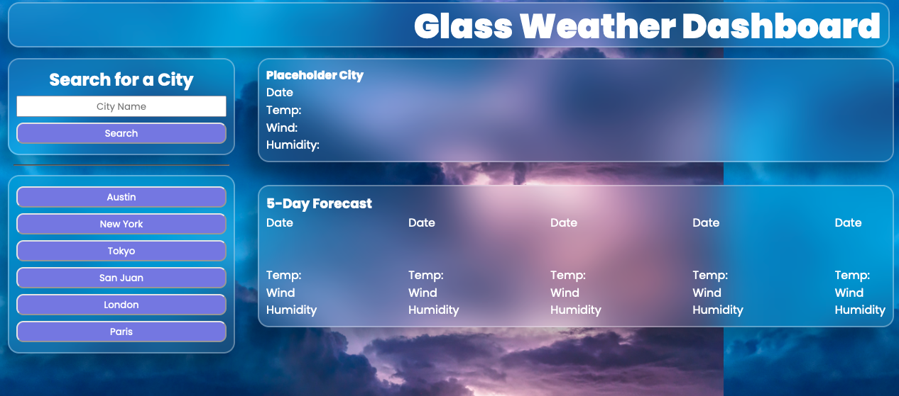
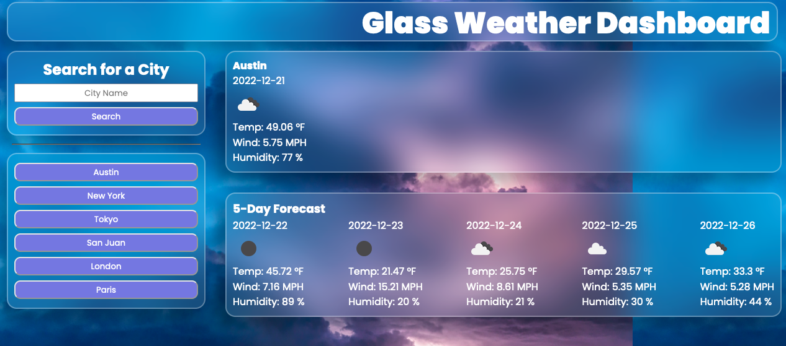

# Glass-Weather-Dashboard

Glass Weather Dashboard is a webapp designed to enable a person to determine the current and 5 day forcasted weather condition for any arbitrary city. The webapp uses the Glassmorphism UI scheme.

## Table of Contents

- [Description](#description)
- [Screen Shots](#screenshots)
- [Installation](#installation)
- [References](#references)
- [License](#license)

## Description
This repo contains a the Glass Weather Dashboard app and the corresponding code.

Github Repository: [Glass Weather Repo](https://github.com/rbarbosa51/Glass-Weather-Dashboard)

Github Pages: [Glass Weather Page](https://rbarbosa51.github.io/Glass-Weather-Dashboard/)

## Screenshots
Glass Weather App

Search 1

Search 2

## Installation

It is meant to be viewed from Github Pages. To enjoy this experience visit:

[Glass Weather Dashboard](https://rbarbosa51.github.io/Glass-Weather-Dashboard/)

## References

Open Weather Map: [openweathermap](https://openweathermap.org/api/geocoding-api#direct)

Open Weather Icon Guide: [openweather icon](https://openweathermap.org/weather-conditions)

CSS Variables: [CSSVariables](https://www.w3schools.com/css/css3_variables.asp)

Favicon Generator: [favicon.io](https://favicon.io)

## License

MIT License

---- 
